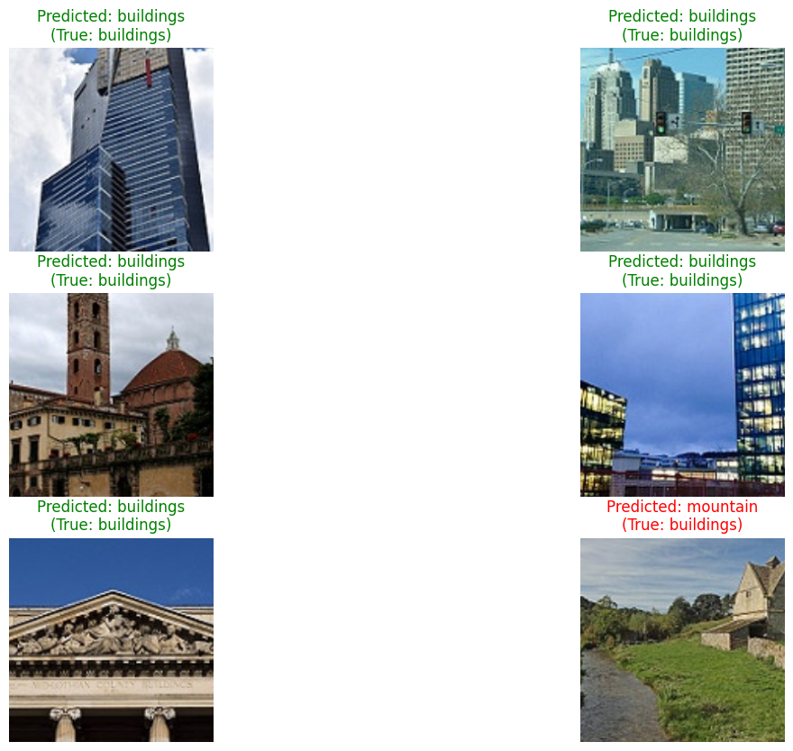

# Image Classification for Natural Scenes (Computer Vision)

### A project on building a deep learning model to classify images of natural scenes using Transfer Learning with PyTorch and ResNet.


## Project Overview

This project delves into the field of **Computer Vision**, showcasing an end-to-end workflow for a multi-class image classification task. The goal is to train a deep learning model capable of accurately classifying images into one of six categories of natural scenes: `buildings`, `forest`, `glacier`, `mountain`, `sea`, and `street`.

The core of this project is the application of **Transfer Learning**, a powerful technique where a pre-trained model is fine-tuned for a new, specific task. We use the famous **ResNet18** architecture, pre-trained on the massive ImageNet dataset.

## Key Skills & Techniques Demonstrated

*   **Computer Vision Fundamentals:** Handling a large dataset of images and preparing it for a deep learning model.
*   **PyTorch & Torchvision:** Proficient use of the PyTorch framework and its `torchvision` library for building a data pipeline and modeling.
*   **Transfer Learning:** A practical implementation of fine-tuning a pre-trained Convolutional Neural Network (CNN). This involves "freezing" the weights of the feature extraction layers and training only the final classification layer.
*   **Data Augmentation:** Applying transformations like random crops and flips to the training data to make the model more robust and prevent overfitting.
*   **GPU-Accelerated Training:** The project is configured to leverage GPU hardware (if available) for efficient training of the deep learning model.

## Model Performance

The fine-tuned **ResNet18** model achieved an impressive **91% accuracy** on the unseen test set after just 10 epochs of training. This outstanding result highlights the effectiveness of transfer learning for computer vision tasks, allowing us to achieve state-of-the-art performance with minimal training time.

## How to Run This Project

1.  **Prerequisites:**
    *   For GPU support, a compatible NVIDIA GPU with CUDA drivers is required.
    *   The large image dataset must be downloaded separately.

2.  **Download the Dataset:**
    *   Download the "Intel Image Classification" dataset from [this Kaggle page](https://www.kaggle.com/datasets/puneet6060/intel-image-classification).
    *   Unzip the file and place the `seg_train` and `seg_test` folders inside the `data/` directory.

3.  **Clone the repository and set up the environment:**
    ```bash
    git clone https://github.com/takzen/image-classification-cnn.git
    cd image-classification-cnn
    uv venv -p 3.11
    source .venv/bin/activate
    uv pip install -r requirements.txt
    ```

4.  **Run the Jupyter Notebook** (`image_classification_cnn.ipynb`).

## Visualizations Showcase



*A sample of the model's predictions on the test set. Green titles indicate a correct prediction, while red would indicate an error.*